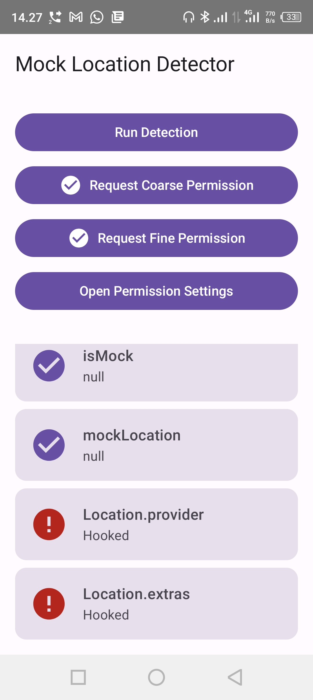
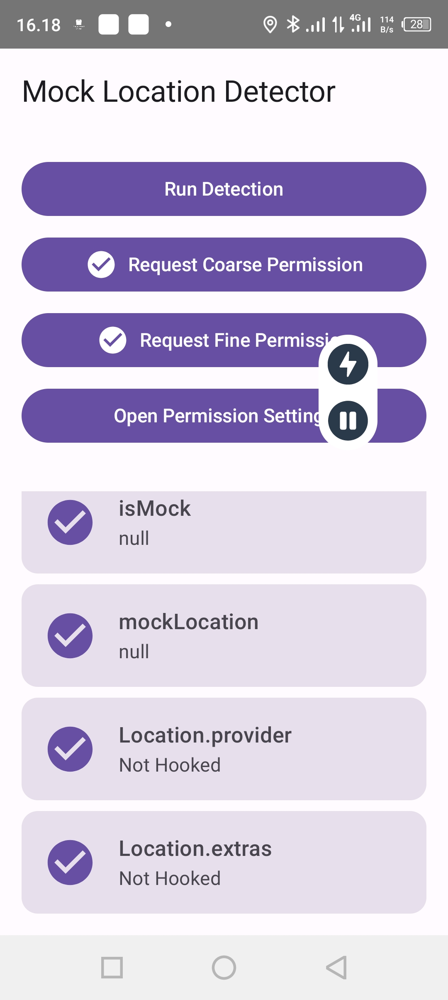

# Hide Mock Location (Forked & Enhanced)
**Prevents detection of mock location**
**Supports Android 6–16**
**Test App**: **[MockLocationDetector](https://github.com/auag0/MockLocationDetector)**

> **❤️ Support the Original Developer:**
> This is a customized fork. Massive credits and support go to the original creator, **[auag0](https://github.com/auag0)**, for the core foundation of this module. Please consider checking out and starring the [original repository](https://github.com/auag0/HideMockLocation).

## 🌟 What's Fixed & Improved in This Fork?
This version introduces advanced context-awareness and critical bug fixes to make the module completely invisible to aggressive detector apps:
* **Context-Aware Anti-Honeypot:** Fixed the "Hooked" detection (red flags) in *MockLocationDetector*. The module now intelligently inspects the timestamp of `Location` objects. It ignores dummy objects created locally by detector apps and only manipulates genuine system GPS data, bypassing honeypot traps perfectly.
* **Syntax & Stability Patches:** Fixed Kotlin syntax parsing errors (e.g., `Settings\$Secure`) ensuring flawless compilation and stability, especially for builds executed on mobile IDEs.

### 📸 Proof of Concept (Bypass Honeypot)
| Before (Original Module) | After (Enhanced Fork) |
| :---: | :---: |
|  |  |
| *Flagged as "Hooked" by honeypot traps* | *Completely invisible to detectors (Not Hooked)* |

## Compatibility Notes
- For **Xposed API 100 or lower**: Please use **[v1.2.2](https://github.com/auag0/HideMockLocation/releases/tag/v1.2.2) or below**.
- For **Xposed API 101 or higher**: **[v2.0.0 or above](https://github.com/auag0/HideMockLocation/releases)** is recommended.

## Usage
1. Download the APK from the [latest releases](https://github.com/auag0/HideMockLocation/releases/latest) and install it on your device.
2. Enable the module in your Xposed manager.
3. If you are using **LSPosed**, select the target apps from which you want to hide the mock location.
4. To apply this to all apps, you can select the following in your scope (***Recommended***):
   * **System Framework** (system)
   * **Settings Storage** (com.android.providers.settings)
5. Reboot your device (if required by your Xposed manager) and you're all set!

## Hooked Methods
- `android.location.Location`
  - `isFromMockProvider()`
  - `isMock()`
  - `setIsFromMockProvider()`
  - `setMock()`
  - `getExtras()`
  - `setExtras()`
  - `set()`
- `android.provider.Settings`
  - `Secure.getStringForUser()`
- `android.app.AppOpsManager`
  - `checkOp()`
  - `checkOpNoThrow()`
  - `unsafeCheckOp()`
  - `unsafeCheckOpNoThrow()`
- `com.android.providers.settings.SettingsProvider`
  - `call()`
- `com.android.server.appop.AppOpsService`
- `com.android.server.AppOpsService`
  - `checkOperationImpl()`
  - `checkOperation()`

## How to set Mock Location app via ADB ([Stack Overflow](https://stackoverflow.com/questions/40414011/how-to-set-the-android-6-0-mock-location-app-from-adb/43747384#43747384))

### Granting Permission
`adb shell appops set <MOCK_LOCATION_APP_PKG> android:mock_location allow`

### Revoking Permission
`adb shell appops set <MOCK_LOCATION_APP_PKG> android:mock_location deny`
> **Note:** For rooted devices using a terminal emulator on the device itself, omit the `adb shell` prefix.

## Disclaimer
**Use this module at your own risk.** The developer assumes no responsibility for any damage, data loss, or issues caused by the use of this software.

## Credits & References
* [auag0](https://github.com/auag0) (Original Developer)
* [ThePieMonster#HideMockLocation](https://github.com/ThePieMonster/HideMockLocation)
* 
